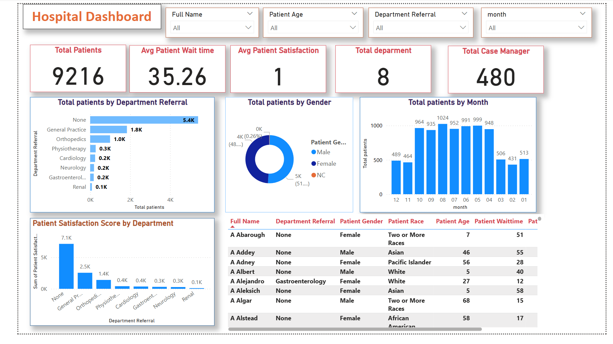

# 📊 Hospital KPI Dashboard

## 🏥 About the Project
This **Power BI dashboard** provides **key insights** into hospital performance, helping analyze:
- ✅ Total Patients
- ✅ Average Patient Wait Times
- ✅ Patient Satisfaction Scores
- ✅ Department-wise Patient Count
- ✅ Gender & Monthly Trends

## 📂 Project Structure
```
/Hospital-KPI-Dashboard
│── 📂 Data
│   ├── hospital_data.csv  (Dataset used for visualization)
│── 📂 Dashboard
│   ├── hospital_dashboard.pbix  (Power BI project file)
│── 📂 Screenshots
│   ├── dashboard_preview.png  (Dashboard screenshot)
│── 📜 README.md  (Project documentation)
│── 📜 LICENSE (Optional)
```

## 🛠 Technologies Used
- **Power BI** for dashboard creation
- **SQL** for data processing (if applicable)
- **Excel** for initial data cleaning (if applicable)

## 🚀 How to Use
1. **Download** the `hospital_dashboard.pbix` file.
2. Open it in **Power BI Desktop**.
3. Load data and **refresh** to view updated insights.
4. Interact with slicers & visuals to explore **hospital performance**.

## 📷 Screenshot


---
### 🌟 Contributing
If you’d like to improve this dashboard, feel free to **fork the repository** and submit a pull request. Contributions are welcome!

### 📜 License
This project is open-source and available under the [MIT License](LICENSE).

### 👤 Author
Created by **[Your Name]**  
Connect with me on **[LinkedIn](https://www.linkedin.com/)**!

